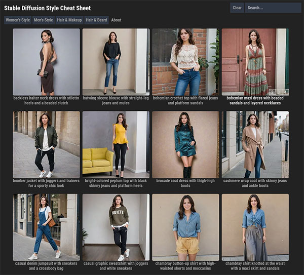

# Stable Diffusion Style Cheat Sheet

A stand alone web site to guide users on different styling prompts for Stable Diffusion relating to fashion styling, hair and make up. It allows custom additions and local hosting and can be used as a visual guide to other forms of prompt and output image association.

- SDXL images are generated using Stable Diffusion XL with the [RealVisXL V3.0 + Turbo](https://civitai.com/models/139562/realvisxl-v30-turbo) checkpoint
- FLUX images are generated using [FLUX.1 Dev](https://huggingface.co/black-forest-labs/FLUX.1-dev) with [TeaCache](https://github.com/ali-vilab/TeaCache).
- Favicon is by [ionicons](https://github.com/ionic-team/ionicons)
- [Vanillia LazyLoad](https://github.com/verlok/vanilla-lazyload)
- SVG spinners [by Utkarsh Verma](https://github.com/n3r4zzurr0/svg-spinners)
- Site inspired by [SupaGruen's cheatsheet](https://supagruen.github.io/StableDiffusion-CheatSheet/)



## Hosting locally

You can host this locally by running a local web server.

Simplest way is by using Python HTTP server then visiting <http://localhost:8000/>

```bash
python -m http.server
```

For web developmenet, I used [live-server](https://github.com/tapio/live-server) for its excellent live reloading when editing files.

## Custom categories

Custom image categories can be added to the cheat sheet by creating a `/custom.json` to the project e.g

```json
{
  "useCustom": true,
  "items": ["nsfw"]
}
```

Then adding `data/custom-nsfw.json` and images to `images/custom-nsfw/`. Use 4 images per prompt in the format `<prompt>.[1-4].webp`.
